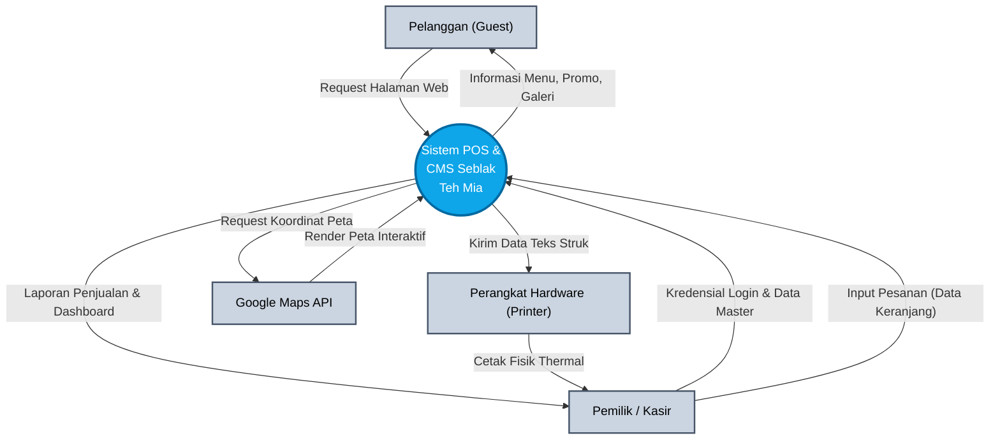
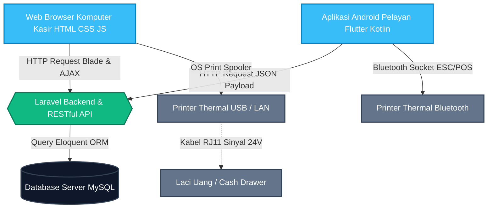
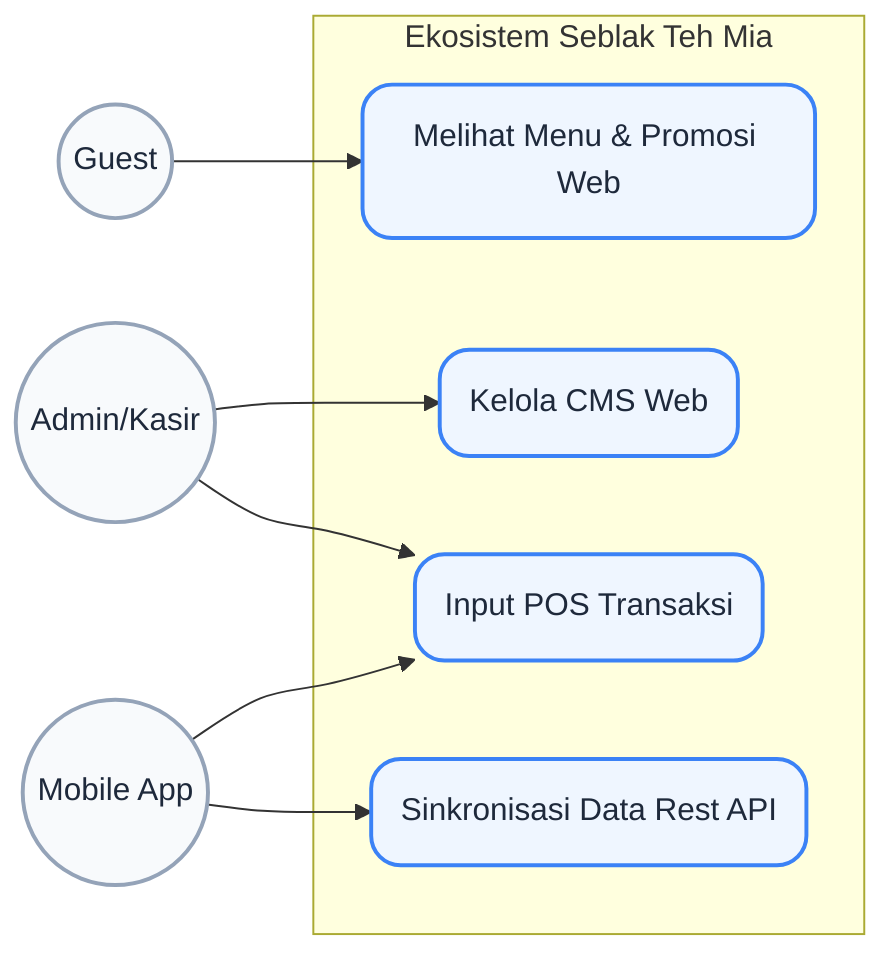
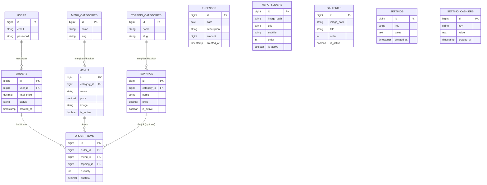
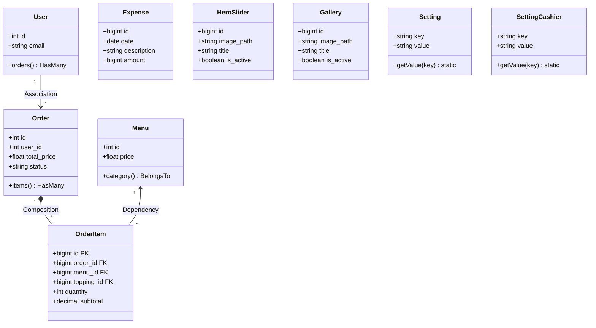
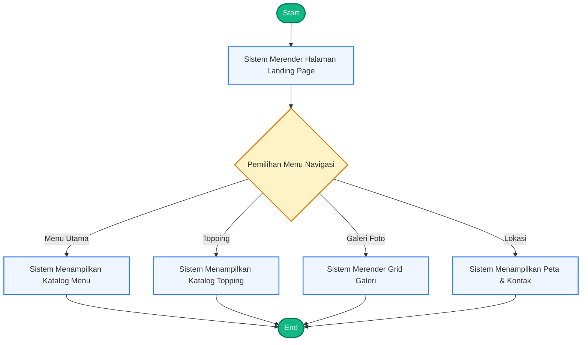
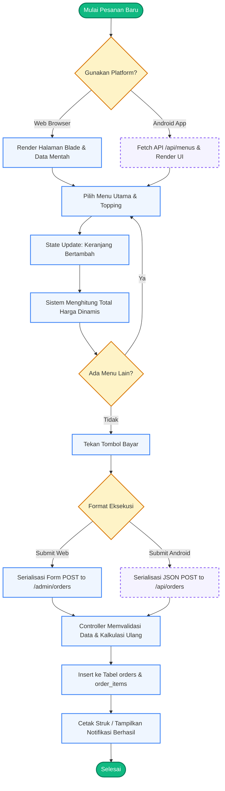
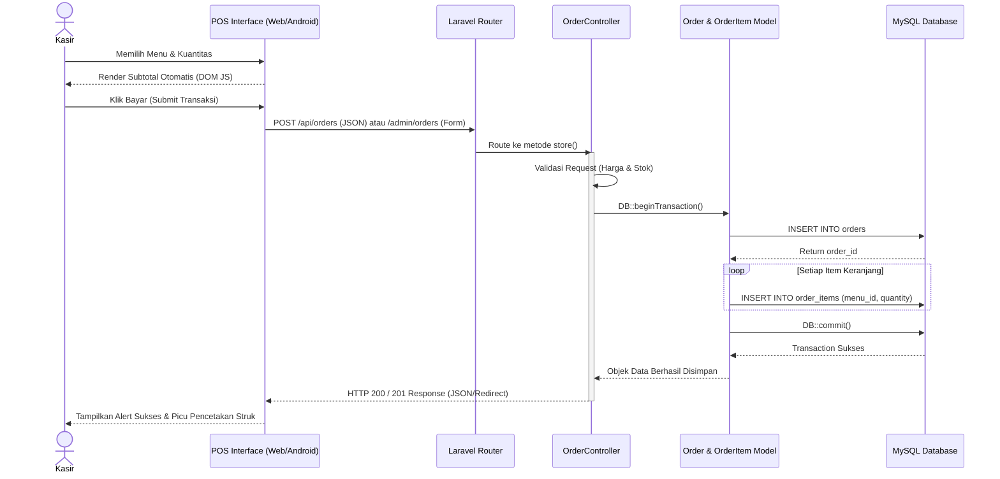

# DOKUMENTASI SPESIFIKASI KEBUTUHAN PERANGKAT LUNAK (SKPL)

**Sistem Informasi POS Seblak Teh Mia** adalah solusi digital untuk manajemen warung seblak yang mencakup pencatatan transaksi kasir, pengelolaan stok bahan baku, hingga laporan laba rugi otomatis. Dengan integrasi CMS, pemilik dapat memantau bisnis dari mana saja.
 
Dokumen ini disusun sebagai rujukan teknis (spesifikasi desain perangkat lunak) yang mengacu pada standar rekayasa perangkat lunak (*Software Engineering*). Dokumen ini memuat arsitektur sistem komprehensif mulai dari Kebutuhan Fungsional & Non-Fungsional, Spesifikasi Teknologi, detail alur kerja Kasir (POS), hingga permodelan sistem secara visual (*Use Case*, ERD, *UML Class Diagram*, dan *Activity Diagram*).

---

## 1. Spesifikasi Teknologi (Technology Stack)
Sistem ini terbagi menjadi dua *platform* utama (Web Application & Mobile Android) yang saling terhubung melalui RESTful API.

### A. Tumpukan Teknologi Web (Backend & Frontend CMS)
- **Bahasa Pemrograman Utama:** PHP 8.2+
- **Kerangka Kerja Backend (Framework):** Laravel 11.x
- **Database Management System (DBMS):** Relational Database (Mendukung MySQL / MariaDB / SQLite)
- **Otentikasi & Keamanan:** Laravel Fortify (Autentikasi Session-based) & Spatie Permission
- **Antarmuka Pengguna (Frontend):** 
  - Laravel Blade Templating Engine
  - Tailwind CSS v3.x (Styling Utility-First)
  - Vanilla JavaScript (Interaktivitas asinkron & *DOM Manipulation*)
  - SweetAlert2 / Toastr (Notifikasi UI)
  - TinyMCE (Rich Text Editor / WYSIWYG)

### B. Tumpukan Teknologi Aplikasi Android (Companion App)
Aplikasi seluler (*mobile*) berfungsi sebagai antarmuka alternatif (baik bagi pemilik untuk memantau, maupun bagi *waiter*/*kasir* keliling).
- **Kerangka Kerja (Framework):** Flutter (Dart) atau Kotlin Native (Mendukung integrasi UI secara imperatif & deklaratif).
- **Protokol Komunikasi:** RESTful API mengonsumsi data *endpoint* Laravel (`/api/*`) dalam format JSON.
- **Client Networking:** Library `Dio` / `http` (Flutter) atau `Retrofit` (Kotlin) untuk mengelola *request* HTTP asinkron.
- **Manajemen State:** Provider / Riverpod / BLoC (tergantung implementasi skalabilitas).
- **Penyimpanan Lokal:** Shared Preferences / SQLite lokal (meng- *cache* token *bearer* otentikasi).

---

## 2. Daftar Fitur Sistem
Aplikasi dibagi menjadi beberapa ruang lingkup (*scope*) utama berdasarkan *platform* dan *role*:

### A. Modul Publik / Guest (Front-End Web)
1. **Landing Page Dinamis:** Menampilkan Hero Banner, ringkasan menu unggulan, dan *slider* foto promosi yang dikelola otomatis oleh Admin.
2. **Katalog Menu & Topping:** Daftar komprehensif produk makanan/minuman yang tersedia.
3. **Galeri Visual & Lokasi:** Portofolio foto produk beserta integrasi Google Maps dan kontak toko.

### B. Modul Admin (Back-End CMS & Web POS)
1. **Dashboard Analitik:** Menyajikan ringkasan statistik harian (total pesanan, total menu/topping aktif).
2. **Manajemen Master Data:** Operasi CRUD penuh untuk Menu, Topping, dan Galeri media.
3. **Modul Pengaturan Web (Web Settings):** Modifikasi warna UI, banner, popup, dan sosial media.
4. **Modul Transaksi (Point of Sale):** Antarmuka interaktif yang menggunakan *Vanilla JavaScript DOM events* untuk perhitungan tagihan secara *real-time* tanpa *refresh* halaman (SPA-like feel).

### C. Modul Aplikasi Android (Mobile Companion)
1. **Mobile POS (Kasir Keliling):** Memungkinkan pelayan mendatangi meja pelanggan dan langsung menginput pesanan ke dalam *tablet* atau ponsel Android. Data terkirim sinkron ke *database* utama Laravel.
2. **Mobile Dashboard:** Pemilik toko dapat memantau grafik penjualan dan rekap transaksi harian langsung melalui *smartphone* Android di mana pun berada.
3. **Pindai QR Menu:** Memungkinkan integrasi pemindaian QR-Code secara langsung untuk membuka katalog.

---

## 3. Analisis Kebutuhan Sistem

### 3.1. Kebutuhan Fungsional (*Functional Requirements*)
- **FR-01:** Sistem Web **HARUS** memungkinkan *Guest* untuk melihat daftar menu dan topping yang aktif.
- **FR-02:** Sistem **HARUS** memiliki portal otentikasi login aman menggunakan *session* untuk web dan *Bearer Token JWT/Sanctum* untuk API Android.
- **FR-03:** Modul POS (Web & Android) **HARUS** mampu mengalkulasi harga dinamis menggunakan rumus: *(Harga Menu Utama + Total Harga Topping yang dipilih) x Kuantitas*.
- **FR-04:** Modul POS **HARUS** memanipulasi *DOM Element* (Javascript) secara *real-time* untuk memperbarui angka keranjang belanja (*cart summary*) di layar sebelum transaksi difinalisasi (*Submit Data*).
- **FR-05:** Aplikasi Android **HARUS** mampu mengirimkan JSON *Payload* ke *endpoint* `/api/orders` yang kemudian diproses oleh *OrderController* di Laravel.
- **FR-06:** Sistem **HARUS** merekam setiap pesanan (Tabel `orders`) beserta detail varian item (Tabel `order_items`).

### 3.2. Kebutuhan Non-Fungsional (*Non-Functional Requirements*)
- **NFR-01 (Kinerja):** Waktu respon antarmuka POS web saat menambahkan *item* ke keranjang tidak boleh ada jeda (*latency < 100ms*) dengan mengandalkan JS *Client-side computation*.
- **NFR-02 (Keamanan):** Implementasi proteksi perlindungan CSRF (*Cross-Site Request Forgery*) pada seluruh formulir Web, dan API Android hanya menerima *request* dengan struktur *Header Authorization* yang valid.
- **NFR-03 (Keusabilitas):** Antarmuka POS harus menggunakan kontras warna optimal dan tombol-tombol yang besar (*Tap-friendly*) agar kasir tidak salah klik pada layar sentuh/ *touchscreen*.

---

## 4. Mekanisme Alur Modul Kasir (Web POS)
Modul Kasir (*Point of Sale*) adalah inti *backend* transaksional. Sistem kerjanya dibangun sedemikian rupa agar cepat dan reliabel:
1. **Inisialisasi Antarmuka:** Sistem merender daftar *Menu* dan *Topping* beserta ID dan harga mentah (*data-attributes*) ke *browser* pengguna.
2. **Event Listeners (JavaScript):** Setiap kali tombol "Pilih Menu" diklik, sistem tidak memuat ulang halaman (*No Reload*), melainkan JavaScript akan mencegat (*intercept*) aksi tersebut dan menyalin referensi ID menu ke dalam memori struktur objek keranjang (*Cart Array*).
3. **Kalkulasi Dinamis:** Setiap perubahan pada keranjang (pengurangan/penambahan jumlah porsi atau topping) memicu *fungsi* hitung ulang. Angka di layar akan berubah seketika.
4. **Finalisasi & Serialisasi (AJAX / Form Submit):** Saat kasir menekan tombol "Bayar", sistem JS akan men-serialisasi array keranjang menjadi struktur data JSON tersembunyi (*Hidden Input*) atau AJAX *Payload*, lalu dikirim ke fungsi `store()` di dalam `OrderController.php`.
5. **Database Transaction:** Laravel memastikan integritas data dengan `DB::transaction()`. Sistem memotong *stok* (bila ada logikanya) dan menulis baris *record* di tabel `orders` dan sekian baris `order_items`. Transaksi sukses me- *return* respon positif dan halaman me-*reset* status keranjang.

---

## 5. Pengelolaan Keamanan & Hak Akses (RBAC)
Keamanan aplikasi dijaga melalui arsitektur *Role-Based Access Control* (RBAC) menggunakan standar integrasi Spatie Laravel Permission. Pengendalian otoritas dilakukan dengan pemetaan yang tegas:
1. **Pemisahan Sesi (Session Hijacking Prevention):** Middleware `auth` memastikan setiap *route* operasional tertutup dari injeksi langsung URL tanpa sesi login yang sah.
2. **Kriptografi:** Kata sandi disimpan dengan enkripsi searah (Bcrypt Hash) di basis data.
3. **Matriks Otoritas:**
   - **Guest (Anonim):** Akses murni baca-saja (*Read-Only*) untuk semua rute `/` (*Landing Page*). Tidak bisa masuk ke rute `/admin`.
   - **Kasir (Operator):** Diberikan hak akses (`Permissions`) sebatas pada modul `Dashboard` dan `Transaksi/POS`.
   - **Super Admin (Pemilik):** Memegang *Role* tertinggi. Mampu mengakses *semua* modul secara total tanpa batas (Termasuk Pengaturan Web dan Master Data).

---

## 6. Diagram Alir Data Kontekstual (DFD Level 0)
Diagram Konteks menggambarkan batas dan ruang lingkup sistem pada level abstraksi tertinggi. Diagram ini memvisualisasikan data apa saja yang masuk (*Input*) dan keluar (*Output*) dari entitas eksternal menuju Sistem Informasi Seblak Teh Mia.

---

## 7. Topologi Jaringan & Integrasi Perangkat Keras (Hardware)
Ekosistem Seblak Teh Mia dirancang agar dapat saling terhubung secara mulus (*seamless*) antara Server Web, Perangkat Mobile Android, dan Perangkat Keras Kasir seperti Pencetak Struk (*Thermal Printer*).

### 5.1. Alur Interkoneksi Sistem (Deployment Topology)
1. **Server Pusat (Cloud / Local Server):** Mesin peladen yang menampung *Web Server* (Nginx/Apache) dan *Database Server* (MySQL/MariaDB). Berperan sebagai otak utama (*Single Source of Truth*) tempat aplikasi Laravel memvalidasi dan memproses semua logika transaksi.
2. **Klien Web (Web POS):** Perangkat komputer/laptop di meja kasir utama yang mengakses sistem melalui peramban web (*Web Browser*). Komunikasi terjadi menggunakan protokol HTTP/HTTPS konvensional untuk *render* halaman (Blade) dan AJAX untuk aksi dinamis.
3. **Klien Mobile (Aplikasi Android):** Perangkat genggam (*Smartphone/Tablet*) milik pelayan atau manajer toko yang berkomunikasi dengan Server Pusat secara nirkabel (Wi-Fi Lokal atau Data Seluler). Interaksi ini secara murni menggunakan pertukaran data JSON via arsitektur RESTful API.

### 5.2. Mekanisme Pencetakan Struk (Thermal Printer Flow)
Fitur cetak struk didesain agar kompatibel di kedua *platform* tanpa ada yang saling mengunci:

1. **Integrasi Printer via Web POS (Komputer Kasir):**
   - **Teknik CSS Media Queries:** Sistem memanfaatkan fitur bawaan browser melalui pemanggilan fungsi Javascript `window.print()`. Tampilan layar yang tadinya besar, akan di- *override* oleh spesifikasi CSS `@media print` sehingga lebarnya dimampatkan menyesuaikan kertas struk termal ukuran standar 58mm atau 80mm. Elemen navigasi akan disembunyikan.
   - **Aliran Komunikasi:** Perintah dari browser diteruskan ke *Print Spooler* pada *Sistem Operasi (Windows/Mac/Linux)* yang kemudian mengirimkannya ke Printer Thermal yang terhubung lewat kabel USB atau jaringan LAN.
   - **Hardware Trigger:** Sistem juga mampu mengirimkan sinyal perintah khusus (umumnya melalui konfigurasi *driver* OS atau ekstensi pihak ketiga seperti *QZ Tray*) untuk membuka Laci Uang (*Cash Drawer Kick*) secara otomatis setiap *receipt* selesai dicetak.

2. **Integrasi Printer via Aplikasi Android (Mobile POS):**
   - **Protokol ESC/POS Langsung:** Berbeda dengan Web, Aplikasi Android tidak melalui *browser*. Aplikasi menggunakan pustaka (*library*) pihak ketiga (misalnya `esc_pos_bluetooth` untuk Flutter) untuk membuat paket-paket instruksi *byte*.
   - **Aliran Komunikasi:** Setelah pesanan berhasil disubmit ke API Laravel, server merespons dengan JSON rincian transaksi sukses. Android mengambil JSON tersebut, menyusun teks struk (beserta instruksi seperti cetak tebal, perataan tengah, pemotongan kertas), dan menembakkan data mentah tersebut langsung ke **Printer Thermal Bluetooth** secara lokal. Pengiriman paket data pencetakan ini murni bersifat *Peer-to-Peer* (*Client-to-Device*) tanpa membebani server sama sekali.

### 5.3. Diagram Topologi Jaringan & Komunikasi

---

## 6. Pemodelan Arsitektur Visual

### 6.1. Use Case Diagram (Web & Mobile)

### 6.2. Entity Relationship Diagram (ERD)

### 6.3. UML Class Diagram

### 6.4. Activity Diagram: Penjelajahan Publik (Front-end)

### 6.5. Activity Diagram: Alur Operasional Sistem Kasir (POS) & Android
Diagram ini mendeskripsikan proses alur eksekusi mulai dari input hingga sinkronisasi data *back-end*.

### 6.6. UML Sequence Diagram: Transaksi Kasir (POS)
*Sequence Diagram* memodelkan urutan interaksi pengiriman pesan (*messaging*) antar objek dari waktu ke waktu secara vertikal, merepresentasikan presisi pertukaran data saat sebuah transaksi dikirim oleh Kasir ke *Server*.

